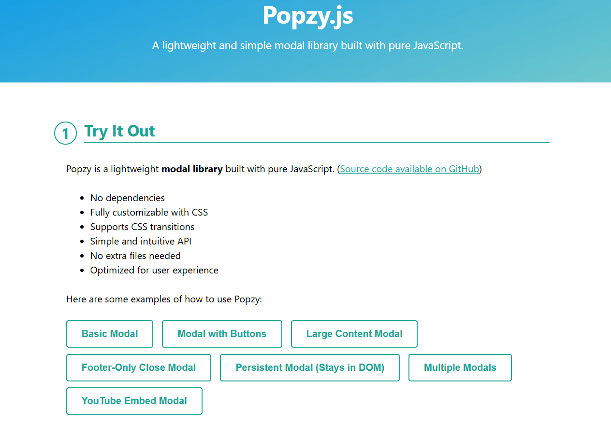

# Popzy.js - Lightweight Vanilla JS Modal Library

Popzy.js is a lightweight and easy-to-use **modal library** written in **pure JavaScript**. It requires **no dependencies**, is fully customizable via **CSS**, and has an intuitive API for creating modals effortlessly.

## 📌 Demo


Try out Popzy.js live:
🔗 **[Live Demo](https://thanhhang31023.github.io/popzy/)**

## 🚀 Features
- 🔥 **No dependencies** – Runs on vanilla JavaScript.
- 🎨 **Fully customizable** – Modify modal styles easily with CSS.
- 🎬 **Smooth animations** – Supports fade-in and scale effects.
- 🏗 **Lightweight** – Just **~2KB** minified.
- 🛠 **Simple API** – Easily create, customize, and manage modals.
- 🚀 **Works everywhere** – Compatible with all modern browsers.

## 📦 Installation

### 1️⃣ **CDN (Recommended)**
Add the following lines to your HTML file:

```html
<!-- Popzy CSS -->
<link rel="stylesheet" href="https://cdn.jsdelivr.net/gh/thanhhang31023/popzy@v1.0.1/popzy.min.css">

<!-- Popzy JS -->
<script src="https://cdn.jsdelivr.net/gh/thanhhang31023/popzy@v1.0.1/popzy.min.js"></script>
```

### 2️⃣ **Download Manually**
[Download Popzy.js](https://github.com/thanhhang31023/popzy/archive/main.zip), extract the ZIP file, and include `popzy.min.js` and `popzy.min.css` in your project.

### 3️⃣ **Using NPM (Future Support)**
_Coming soon!_

## 🎯 Usage

### **Basic Example**
```html
<button id="openModal">Open Modal</button>
<script>
    const modal = new Popzy({
        content: '<h2>Welcome to Popzy!</h2><p>This is a simple modal.</p>',
        footer: true
    });
    document.getElementById("openModal").onclick = () => modal.open();
</script>
```

### **Options**
```js
const modal = new Popzy({
    content: '<h1>Hello Popzy!</h1>',
    footer: true,
    destroyOnClose: false,
    closeMethods: ['overlay', 'button', 'escape'],
    cssClass: ['custom-modal'],
    onOpen: () => console.log("Modal opened!"),
    onClose: () => console.log("Modal closed!"),
});
modal.open();
```

### **Adding Footer Buttons**
```js
modal.addFooterButton("Close", "btn", () => modal.close());
modal.addFooterButton("Confirm", "btn btn-primary", () => alert("Confirmed!"));
```

## 🎨 Styling
Popzy uses minimal CSS, allowing full customization. Here are some default classes:
```css
.popzy { background: rgba(0, 0, 0, 0.7); }
.popzy__container { width: 600px; background: white; border-radius: 6px; }
.popzy__close { position: absolute; right: 10px; top: 10px; }
```
You can override these styles to match your design.

## 📜 API Reference
```md
| Method                  | Description |
|-------------------------|-------------|
| `modal.open()`          | Opens the modal |
| `modal.close()`         | Closes the modal |
| `modal.setContent(html)` | Updates the modal content |
| `modal.addFooterButton(label, class, callback)` | Adds a footer button |
| `modal.destroy()`       | Removes modal from DOM |
```

## 📬 Contact
- 👤 **NGUYEN THI THANH HANG**
- 📧 **thanhhang31023@gmail.com**

